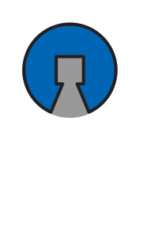

# The Open Alliance

  

## What is The Open Alliance?
The #openalliance members all believe that FRC can have a greater impact on all teams if our ideas are shared throughout the season. With the end of The Bag, there’s a chance that FRC teams may become more secretive than they are now, and we’re hoping to stop that trend before it has a chance to start. We think that teams can share information and still be competitive, and that a rising tide lifts all boats.

Any team is welcome to join The Open Alliance at any time. We simply ask that you follow these guidelines.

## Guidelines for participation
1) **Don't keep secrets**
   * Sharing and learning is our competitive advantage, not secrets.
   * Don't withold "that one detail" that makes an idea or mechanism work.  If you share it, share it all.
3) **Try to update 1 or more times per week.**
   * Include analysis and notes
   * Include thoughts on what went well and what did not.
4) **Use a platform that is conducive to asking and answering questions.**
   * We recommend making official update posts in your build thread on [ChiefDelphi](chiefdelphi.com) and cross-posting to [Discord](https://discord.gg/pMxQD8SgJh) for further discussion.
   * Try to share important information, or the results of important discussions, on both platforms.
5) **Post lots of pictures and videos.**
   * People love to look at pictures and videos
   * A picture really is worth 1000 words.
6) **Open CAD and code are encouraged but not required.**
7) **Include the bad with the good.**
   * We want a complete picture, not a highlight reel.
   * Posting the bad helps everyone learn.

------------------------------
## Chief Delphi
* Please tag posts with `#openalliance` and `#frc[teamNumber]` to make them easier to find

## Discord
Join our discord to discuss ideas with other #openalliance teams!
https://discord.gg/pMxQD8SgJh

### Team Channels
Each team can request a build log channel to be created for them where they can post, discuss, and share their build seasons.
